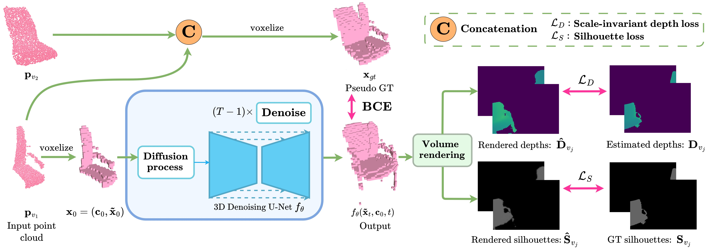

# RealDiff: Real-world 3D Shape Completion using Self-Supervised Diffusion Models

### [**Project Page**](https://realdiff.github.io/) | [**Paper**](https://arxiv.org/abs/2409.10180)

RealDiff formulates point cloud completion as a conditional generation problem directly on real-world measurements in a self-supervised way.

<div align="center">
    
</div>

Given a pair of noisy point clouds representing an object, our pipeline takes one of these point clouds as input, and a pseudo ground-truth is created by combining the two point clouds. A diffusion process is simulated at the missing parts (unoccupied input voxels) of the voxelized input, while conditioning the generation on the known parts (occupied input voxels). To eliminate the noise from the reconstructions, the rendered object shapes' silhouettes and depth maps are constrained to match the auxiliary silhouettes (e.g. from ScanNet) and depth maps (e.g. from a pre-trained Omnidata model). At generation time, only *f<sub>θ</sub>* is used to reconstruct a complete 3D shape from the input real-world point cloud.

## 💻 Code

Code is coming soon.

## 📑 Citation
If you find our work useful, please consider citing:
```
@article{ocal2024realdiff,
  title     = {RealDiff: Real-world 3D Shape Completion using Self-Supervised Diffusion Models},
  author    = {{\"O}cal, Ba{\c{s}}ak Melis and Tatarchenko, Maxim and Karaoglu, Sezer and Gevers, Theo},
  journal   = {arXiv preprint arXiv:2409.10180},
  year      = {2024},
}
```
